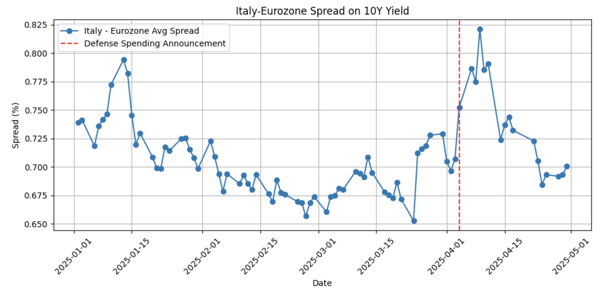
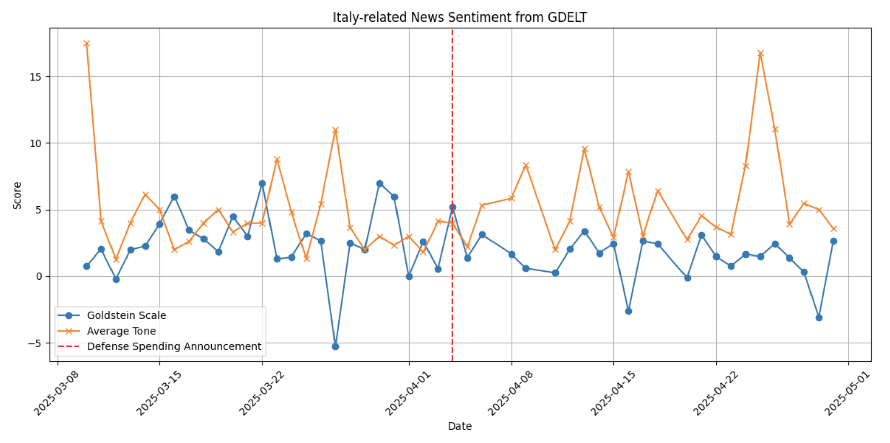
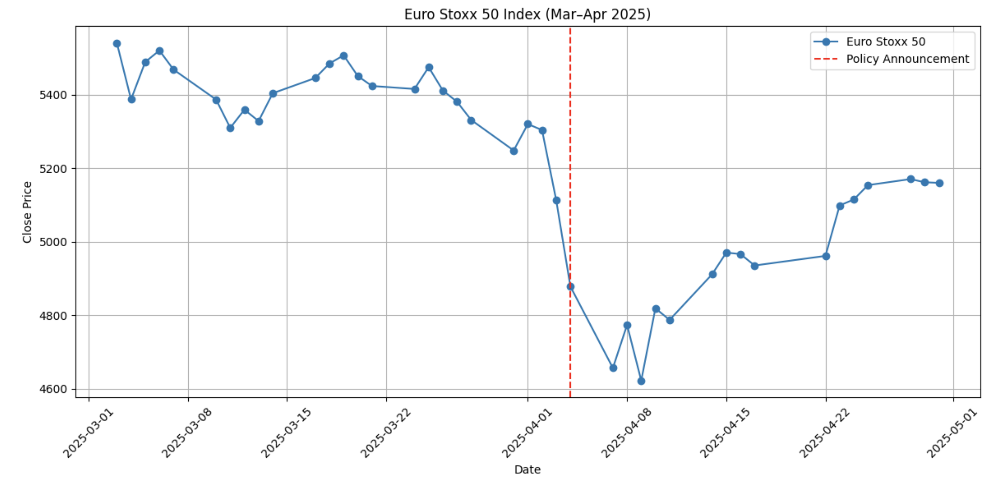
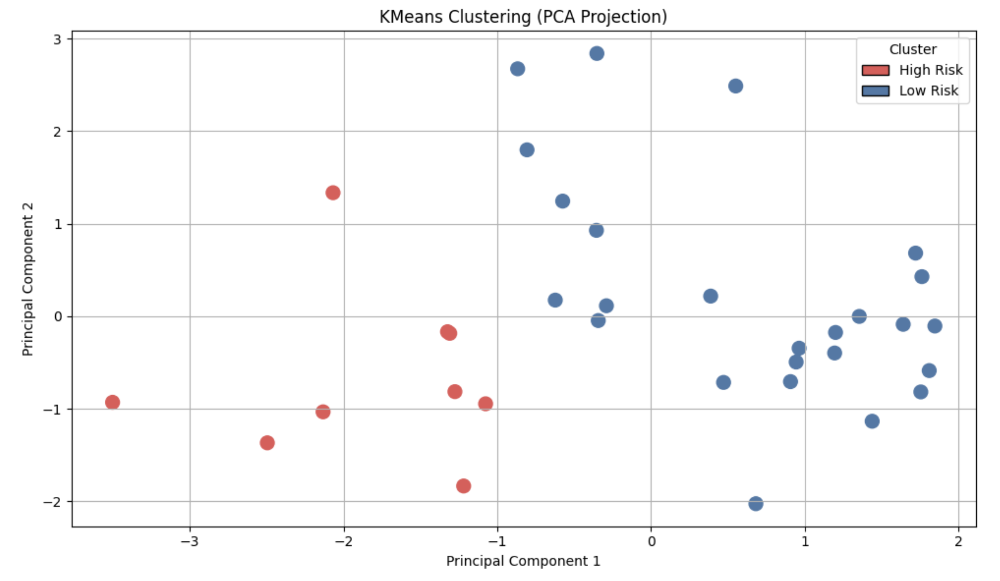
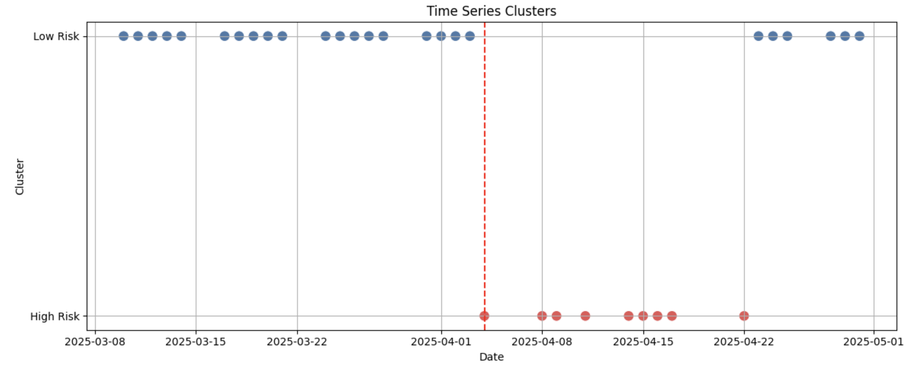

# Political Risk in Real Time: Clustering-Based Study of Italy’s 2025 Defense Spending Event

**Author**:  
- Qinuo Yang ([LinkedIn](https://www.linkedin.com/in/qinuoyang))  

**Course**: COMPSS 224B — *Quantitative Political Risk Analysis*  
**Date**: May, 2025  
**Source Code**: [GitHub Repository](https://github.com/yourname/italy-defense-risk)  

---

## Abstract

In April 2025, Italy announced a significant increase in defense spending, triggering short-term volatility in European markets and news sentiment. This project examines the political risk implications of that event by combining sovereign bond yield spreads, global media sentiment (via GDELT), and equity market indicators.

Using an unsupervised learning approach (KMeans clustering), we construct a lightweight political risk index that captures shifts in market and media behavior following the announcement. Results reveal a clear, short-lived spike in perceived risk—offering a replicable framework for monitoring political shocks using real-time data pipelines.

---

## Table of Contents

- [Background](#background)
- [Exploratory Data Analysis](#exploratory-data-analysis)
- [Model Analysis](#model-analysis)
- [Risk Interpretation](#risk-interpretation)
- [Applications and Next Steps](#applications-and-next-steps)

---

## Background

Italy’s defense policy shift occurred in a high-debt environment, raising market concerns about sovereign risk. Bond spreads widened, news sentiment turned negative, and the Euro Stoxx 50 index dropped—all within days. However, these reactions quickly normalized.

This project bridges political events and market data using:
- Sovereign bond yield spreads (Italy vs. Eurozone)
- GDELT news sentiment (Goldstein Score & Average Tone)
- Euro Stoxx 50 performance (regional equity sentiment)

---

## Exploratory Data Analysis

### 📈 Bond Yields

- Italy’s 10Y yield rose from 4.87% to 5.17% post-announcement.
- The Italy-Eurozone spread peaked at 0.825%.



### 📰 Media Sentiment

- GDELT sentiment metrics showed a temporary dip in Goldstein scores and tone.
- These signals aligned with financial indicators.



### 💶 Market Index

- The Euro Stoxx 50 dropped ~8% after the announcement.
- Markets began recovering within a week.



---

## Model Analysis

### 🔍 Method

Unsupervised KMeans clustering on standardized features:
- Italy’s bond yield
- Italy-Eurozone spread
- News Goldstein Scale
- Average news tone
- Euro Stoxx 50 index

### 📊 Results

PCA projection reveals clear "High Risk" and "Low Risk" clusters.



Cluster 0 = high spread, low sentiment → High Risk  
Cluster 1 = stable signals → Low Risk

### 📉 Time Trend

Risk spiked right after April 4 and stabilized within 7 days.



---

## Risk Interpretation

### 🧪 Hypotheses

- Bond spread widened ⇒ Supported  
- Public sentiment dropped ⇒ Supported  
- CDS/credit data not included ⇒ TBD

### 📌 Takeaways

- Policy-driven shocks trigger rapid but short-lived risk signals.
- Market and media indicators jointly reflect sovereign risk.
- Clustering is a viable early-warning method for political events.

---

## Applications and Next Steps

### 🔁 Applications

- Early risk alerts for asset managers, banks, or political risk insurers
- Monitoring dashboards combining media and market data

### 🚧 Future Work

- Add CDS spreads, FX rates, social media sentiment
- Test DBSCAN or HDBSCAN for non-spherical clusters
- Extend to other countries and longer time windows

---

## Repository Structure

```text
├── report/           # LaTeX source and compiled PDF  
├── src/              # Python scripts  
├── data/             # Raw and cleaned data  
├── figures/          # Plots and visualizations  
└── README.md         # Project overview  
```

---

## Acknowledgments

This project was completed for COMPSS 224B at UC Berkeley.  
Special thanks to the teaching team for their support and guidance.

